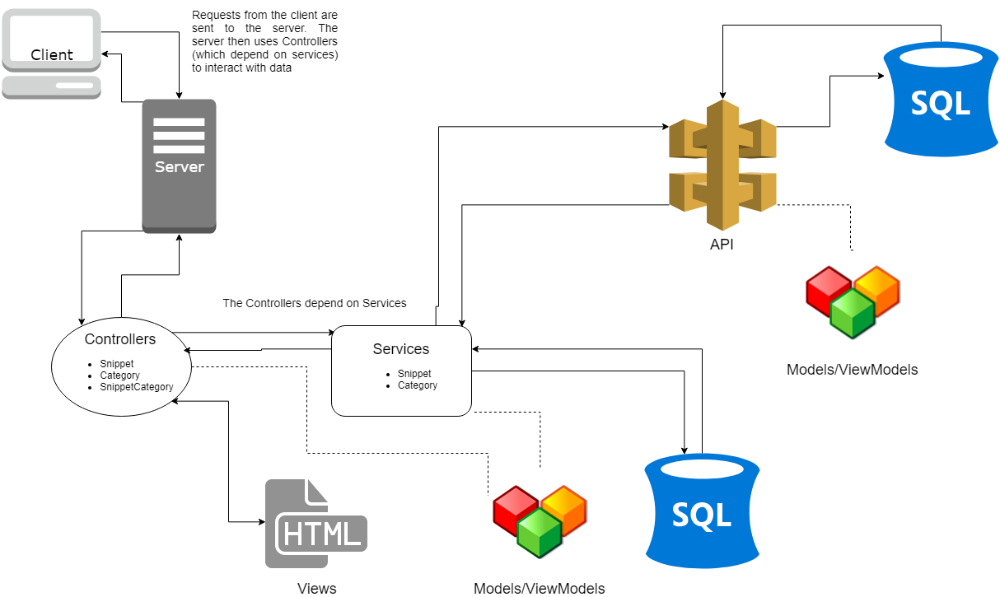

# Project Plan

## Contents
1. [Vision](#vision)
2. [Scope](#scope)
3. [Requirements](#requirements)
4. [User Stories](#user-stories)
5. [Wireframes](#wireframes)
6. [Dataflow Diagram](#dataflow-diagram)
7. [Database Schema](#database-schema)

## Vision
This product will provide a virtual repository that allows users to categorize 
and catalogue code snippets that they find helpful. 
This helps users to keep track of important and helpful solutions to problems they may encounter frequently. 
For example, a user may want to remember how they effectively processed an array of integers and removed all multiples of 5. 

## Scope
* IN:
  - The web app will allow users to save snippets of code.
  - The web app will allow users to categorize their saved snippets by code language.
  - We will allow users to associate snippets with tags like “binary tree” or “search.”
  - We will allow users to search for saved code snippets by tag or category.
  - Each snippet will require a user to add the snippet’s source upon creation.
  - We will allow users to create a “study deck” from a filtered list of snippets where each card in the deck shows the full details associated with a given snippet.

* OUT:
  - We will not allow users to save any other type of data besides text.
  - We will not be creating a mobile app version of this app.
  - We will not require developers to use an API key to acquire or use our API.
  - We will not require users to create accounts with logins.
  
### MVP
A user can create, edit, and delete a snippet and will have the ability to create and delete category tags. There will also be a page where a user can see a list of all their snippets and filter that list by language, category, etc. Either prior to or after filtering, a user can click on a button to review a set of snippets as flash cards.

### Stretch
  - The website will create a new endpoint for unique users so that individual snippet repositories are accessible by a unique URL.
  - The user will see a list of suggested “study decks” on their homepage for quick access to particular decks.
  - The website will be mobile-friendly (responsive)

## Requirements
### Functional Requirements
 - The user can add and delete code snippets.
 - The user can search for code snippets by category or tag.
 - The web app will display code snippets and details. 
 - The web app will have create, update, and delete views.
### Non-Functional Requirements
* Usability
  - Intuitive Design: The UI will be designed in a way where users do not have to rely on external or extra instructions to use the web app.
  - Clean & Concise: The UI will be uncluttered and easy to follow and understand.
* Testability
  - Unit Tests: CRUD Operations 
  - The site will have a small total number of user “paths” (associated with CRUD operations) which makes it easier to test that each user path works as intended.
  - Unit Tests: Routes, Controllers & Views
  
## User Stories

## Wireframes

## Dataflow Diagram

## Database Schema

### Description
* Snippet: This table will hold the data for each individual snippet, such as the name, date, and code snippet body of text. This table also features an Enum for code languages.
* Tag: This table contains the tags that will pertain to snippets created in our database
* Snippet Tags: This is a pure join table that will join snippets and tags, emulating a many to many relationship.
